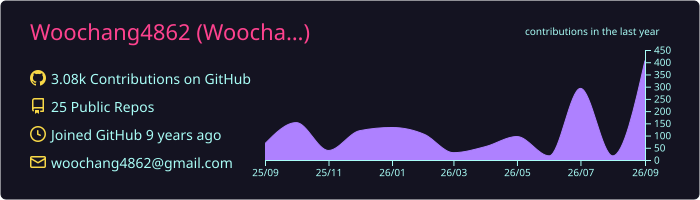
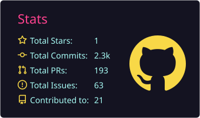
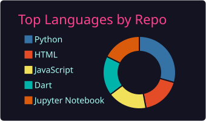

## WHY? : MY DRIVING FORCE! 

저는 **우창**입니다. '왜?'라는 질문에 답하는 것을 중요하게 생각하는 소프트웨어 엔지니어입니다. 지금은 **하드사이언스 AI개발팀**에서 치매 조기진단 AI를 연구하며, 업무 대화가 곧 업무 문서가 되는 사내 AI 서비스 **Omnis**를 만들고 있습니다. 대학에서는 동아리 플랫폼 **동구라미**를 MAU 1,000+ 실서비스로 키웠고, 학교에 해커톤이 없어서 직접 열었습니다. 언제든지 연락 주세요!

---

##  About me

- 코드를 작성할 때 해당 코드의 **역할과 이유**를 중요하게 생각해요.
- SW가 **다양한 분야의 문제**를 해결할 수 있는지에 대해 생각해요.
- 문제에 직면했을 때 **끈기있게** 부딪혀 보는 것을 좋아해요.
- 더 나은 **내일**을 위해 끊임없이 노력해요.

---

## ⚡ Technologies

#### 📱 Mobile & Web

  
  
  
  
  
  
  
  

#### 🧠 AI & Backend

  
  
  
  
  

---

## 🚀 Projects

| 프로젝트 | 무엇을 | 역할 · 성과 | 보기 |
|---|---|---|---|
| **Omnis** | 업무 대화가 곧 업무 문서가 되는 사내 AI 서비스 (Next.js · Prisma · Gemini · RAG) | 풀스택 개발 |   |
| **동구라미** | 수원대학교 동아리 연합회 공식 플랫폼 (Flutter · React 19) | 프론트엔드 팀장 → 개발 총괄 · 배포 빈도 +818% · 누적 가입 498명 / MAU 1,072 |     |
| **Soon** | 2019년부터 운영 중인 상영예정 영화 알림 앱 | 1인 풀스택 · Node.js/MySQL/Redis · AWS EC2 · docker-compose |    |
| **Snowballing AI ETF** | AI 기반 Active ETF 운용 대시보드 — LightGBM LambdaRank + TabPFN 랭킹 모델 (Next.js) | 모델링 · 웹 · 실서비스 배포 |   |
| **화성시 복지 챗봇** | 공공데이터 × LLM 다국어 챗봇 | 프론트엔드 — LLM 스트리밍 응답 UI |  |
| **四季 (사계)** | 인터랙티브 AI 아트 — MARS 2025 코엑스 전시 (수원대학교 대표) | 풀스택 (React · GPT-4o-mini · TouchDesigner) |  |

---

  

  
  

  

